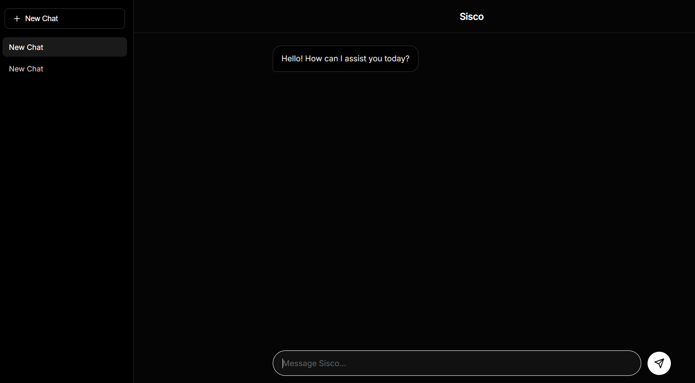

# Sisco AI Chatbot

Sisco is a professional, sleek, and responsive AI chatbot application powered by the Groq API. It features a persistent multi-session chat history, a dark mode aesthetic, and a modern user interface designed for a premium user experience.



## Features

- **Multi-Session Chat History**: Automatically saves and categorizes multiple conversations locally using browser storage.
- **Modern UI**: Designed with a high-contrast monochrome aesthetic for a professional look and feel.
- **Serverless Architecture**: Securely handles API requests through Netlify Functions, ensuring API keys are not exposed to the client.
- **Syntax Highlighting**: Built-in support for rendering code blocks and programming syntax correctly.

## Technologies Used

- HTML5 / CSS3 / JavaScript (Vanilla)
- Netlify Functions (Node.js) for backend API processing
- Groq API for fast AI responses

## Deployment and Setup

This project is configured to be deployed on Netlify.

### Prerequisites

You will need a Groq API Key to run this application. 

### Netlify Deployment

1. Connect your repository to Netlify.
2. Navigate to your site settings in the Netlify dashboard.
3. Under Environment Variables, add a new variable:
   - Key: `GROQ_API_KEY`
   - Value: `your_actual_api_key_here`
4. Trigger a new deploy. Netlify will automatically detect and build the secure function located in the `netlify/functions` directory.

### Local Development

To run this project locally with the serverless functions, use the Netlify CLI:

```bash
npm install -g netlify-cli
netlify dev
```

Note: Ensure you have linked your local environment to your Netlify site or have a `.env` file containing your `GROQ_API_KEY` for local testing.
